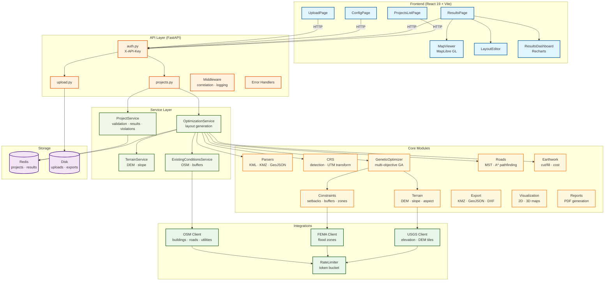

# Architecture

System architecture for Entmoot — an AI-driven site layout automation platform.

---

## High-Level Overview

```
┌─────────────────────────────────────────────────────────────┐
│                     React Frontend                          │
│  UploadPage → ConfigPage → ResultsPage → ProjectsListPage  │
│  MapViewer (MapLibre GL) · LayoutEditor · ResultsDashboard  │
└──────────────────────────┬──────────────────────────────────┘
                           │  HTTP / REST (Axios)
                           │  X-API-Key header (when auth enabled)
┌──────────────────────────▼──────────────────────────────────┐
│                      FastAPI Backend                         │
│                                                              │
│  ┌──────────┐  ┌──────────────┐  ┌───────────────────────┐  │
│  │ API      │  │ Services     │  │ Core Modules           │  │
│  │ Routes   │→ │ project_svc  │→ │ parsers · crs · terrain│  │
│  │ auth.py  │  │ optim_svc    │  │ optimization · roads   │  │
│  │ upload   │  │              │  │ earthwork · constraints│  │
│  │ projects │  │              │  │ export · visualization │  │
│  └──────────┘  └──────────────┘  └───────────────────────┘  │
│                                                              │
│  ┌─────────────────┐  ┌──────────────────────────────────┐  │
│  │ Integrations    │  │ Infrastructure                    │  │
│  │ OSM · FEMA · USGS│ │ Redis storage · File storage     │  │
│  │ rate_limiter    │  │ Cleanup service · Logging/Middleware│
│  └─────────────────┘  └──────────────────────────────────┘  │
└─────────────────────────────────────────────────────────────┘
         │                    │                    │
    ┌────▼────┐         ┌────▼────┐         ┌────▼────┐
    │  Redis  │         │  Disk   │         │ External│
    │ project │         │ uploads │         │  APIs   │
    │ results │         │ exports │         │OSM/FEMA │
    └─────────┘         └─────────┘         │  /USGS  │
                                            └─────────┘
```

---

## Request Lifecycle

A typical project creation flows through:

```
Client POST /api/v1/projects
  │
  ├─ RequestCorrelationMiddleware  → assigns X-Request-ID
  ├─ LoggingContextMiddleware      → injects request context into logs
  ├─ verify_api_key dependency     → validates X-API-Key (if auth enabled)
  │
  ▼
projects.py  create_project()
  ├─ ProjectService.validate_weights()
  ├─ Store project in Redis
  └─ asyncio.create_task(generate_layout_async)
       │
       ▼  (background, ThreadPoolExecutor)
  optimization_service.py  run_optimization_sync()
       ├─ Parse file (KML / KMZ / GeoJSON)
       ├─ Detect CRS → transform to UTM
       ├─ Load DEM → compute slope grid → slope exclusion zones (optional)
       ├─ Query OpenStreetMap → classify features → typed buffers → exclusion zones (optional)
       ├─ Build Asset instances from config
       ├─ Set up constraints + objectives
       ├─ Run GeneticOptimizer (GA)
       ├─ Inverse-transform results → WGS84, compute asset footprint polygons
       ├─ Generate road network (MST-optimized A* pathfinding, fallback: straight lines)
       ├─ Calculate earthwork (cut/fill)
       └─ Store LayoutResults in Redis

Client GET /api/v1/projects/{id}/results
  │
  ▼
projects.py  get_layout_results()
  └─ ProjectService.build_optimization_results()
       ├─ Assemble road network + intersections
       ├─ Detect constraint violations
       ├─ Compute constraint zones (setback buffer)
       ├─ Compute buildable areas (boundary minus setback)
       ├─ Calculate cost breakdown + metrics
       └─ Return OptimizationResults
```

---

## Layer Responsibilities

### API Layer (`src/entmoot/api/`)

Thin HTTP handlers. No business logic — delegates to services.

| File | Responsibility |
|---|---|
| `main.py` | App factory, CORS, lifespan (startup/shutdown), middleware registration, health check |
| `projects.py` | Project CRUD, status polling, results retrieval, re-optimization, export, delete |
| `upload.py` | Multipart file upload with validation (extension, MIME, magic bytes, size) |
| `auth.py` | `verify_api_key` — FastAPI `Security` dependency using `APIKeyHeader("X-API-Key")` |
| `middleware.py` | `RequestCorrelationMiddleware` (X-Request-ID), `LoggingContextMiddleware` (context injection) |
| `error_handlers.py` | Maps `EntmootException` subclasses, Pydantic errors, and unhandled exceptions to JSON responses |

### Service Layer (`src/entmoot/services/`)

Business logic extracted from routes — testable without HTTP.

| File | Responsibility |
|---|---|
| `project_service.py` | Weight validation, result assembly, constraint violation detection, road intersection computation, setback zone / buildable area geometry |
| `optimization_service.py` | `generate_layout_async` (background task), `run_optimization_sync` (file parsing → CRS → DEM → OSM → GA → road gen → earthwork → results) |
| `terrain_service.py` | `prepare_terrain_data()` — DEM loading, validation, reprojection to UTM, cropping, slope computation; `TerrainData` container with elevation/slope sampling methods |
| `existing_conditions_service.py` | `fetch_and_process()` — OSM Overpass query, feature classification, typed buffer generation (buildings, roads, utilities, water), road entry point identification |

### Core Modules (`src/entmoot/core/`)

Domain-specific processing engines.

| Module | What it does |
|---|---|
| `parsers/` | KML/KMZ parsing and validation; coordinate/geometry extraction |
| `crs/` | CRS detection from file content, UTM zone selection, coordinate transformation (PyProj) |
| `terrain/` | DEM loading/validation, slope calculation, aspect analysis, buildability scoring |
| `constraints/` | Setback buffers, exclusion zones, regulatory constraints; typed buffer generation (property lines 25ft, roads 25–100ft, water 100–150ft, utilities 30–100ft) |
| `optimization/` | `GeneticOptimizer` — population-based multi-objective optimization with collision detection, tournament selection, elitism, convergence detection; `get_buildable_area_diagnostic()` for actionable error messages |
| `roads/` | `NavigationGraph` (grid-based), `AStarPathfinder` (grade-aware), `RoadNetwork` (MST-optimized topology with road classification PRIMARY/SECONDARY/ACCESS, intersection generation, exclusion zone avoidance) |
| `earthwork/` | Pre/post-grading models, cut/fill volume calculation, cost estimation |
| `export/` | `KMZExporter`, `GeoJSONExporter`, `DXFExporter` — georeferenced output for Google Earth, QGIS, AutoCAD |
| `reports/` | PDF site report generation (ReportLab) |
| `visualization/` | 2D (Matplotlib) and 3D (Plotly) map rendering with multi-layer support |
| `config.py` | Pydantic `Settings` with `ENTMOOT_` env prefix; CORS validation (rejects `*` in production) |
| `redis_storage.py` | `RedisStorage` singleton — project/result persistence with in-memory fallback when Redis is unavailable |
| `storage.py` | `FileStorageService` — atomic file writes, metadata sidecar JSON, directory-per-upload |
| `cleanup.py` | Background async loop that deletes expired uploads (skips in-progress files) |
| `logging_config.py` | `JSONFormatter` (production), `ColoredFormatter` (dev), rotating file handler |

### Integrations (`src/entmoot/integrations/`)

Rate-limited async HTTP clients for external data sources.

| Module | API | Data |
|---|---|---|
| `osm/` | OpenStreetMap Overpass API | Buildings, highways, power lines, pipelines, water features within site bbox; in-memory cache (24h TTL); retry on 429/5xx |
| `fema/` | FEMA NFHL REST API | Flood zone designations by point or bounding box |
| `usgs/` | USGS EPQS / 3DEP | Point elevation, batch queries, DEM tile download & mosaic |
| `rate_limiter.py` | *(shared)* | Token-bucket `RateLimiter` with `wait_if_needed()` async convenience method |

### Models (`src/entmoot/models/`)

Pydantic v2 data models — serialization boundary between layers.

| File | Key types |
|---|---|
| `project.py` | `ProjectConfig`, `ProjectStatus`, `LayoutResults`, `OptimizationResults`, `PlacedAsset`, `RoadSegment`, `ConstraintViolation`, `CostBreakdown` |
| `assets.py` | `BuildingAsset`, `ParkingLotAsset`, `EquipmentYardAsset`, `StorageTankAsset` |
| `boundary.py` | `PropertyBoundary`, `SubParcel`, geometry metrics |
| `constraints.py` | `SetbackConstraint`, `ExclusionZoneConstraint`, `RegulatoryConstraint` |
| `terrain.py` | `DEMData`, `DEMMetadata`, `DEMValidationResult` |
| `elevation.py` | `ElevationPoint`, `ElevationQuery`, `DEMTileMetadata` |
| `regulatory.py` | `FloodplainData`, `FloodZone` |
| `upload.py` | `UploadMetadata`, `UploadResponse`, `FileType` |
| `errors.py` | `ErrorResponse`, custom exception hierarchy |

---

## Optimization Engine

```
                    ┌─────────────────────┐
                    │  GeneticOptimizer    │
                    │  (genetic_algorithm) │
                    └──────────┬──────────┘
                               │
          ┌────────────────────┼────────────────────┐
          ▼                    ▼                     ▼
  ┌───────────────┐  ┌─────────────────┐  ┌──────────────────┐
  │ Initialization│  │ Selection       │  │ Variation        │
  │ Random / Grid │  │ Tournament (k=3)│  │ Crossover (0.7)  │
  │ / Heuristic   │  │ Elitism (15%)   │  │ Mutation (0.4)   │
  └───────────────┘  └─────────────────┘  └──────────────────┘
                               │
                    ┌──────────▼──────────┐
                    │ Fitness Evaluation   │
                    │  OptimizationObj     │
                    │  (multi-objective)   │
                    └──────────┬──────────┘
          ┌────────────────────┼────────────────────┐
          ▼                    ▼                     ▼
  ┌───────────────┐  ┌─────────────────┐  ┌──────────────────┐
  │ Cut/fill cost │  │ Accessibility   │  │ Compactness      │
  │ weight        │  │ weight          │  │ weight           │
  └───────────────┘  └─────────────────┘  └──────────────────┘
          ▼                    ▼                     ▼
  ┌───────────────┐  ┌─────────────────┐  ┌──────────────────┐
  │ Road length   │  │ Slope variance  │  │ Collision detect │
  │ weight        │  │ weight          │  │ (Shapely)        │
  └───────────────┘  └─────────────────┘  └──────────────────┘
```

**Configurable parameters:** population size (50), generations (150), time limit (120 s), convergence patience (20), diversity weight (0.2).

**Output:** Best solution + diverse alternatives, convergence history, generation metadata.

---

## Road Network Generation

```
                    ┌──────────────────────┐
                    │  optimization_service │
                    │  _generate_road_      │
                    │  network()            │
                    └──────────┬───────────┘
                               │
              ┌────────────────┼────────────────┐
              ▼                ▼                 ▼
     ┌────────────────┐ ┌──────────────┐ ┌────────────────┐
     │ NavigationGraph│ │ AStarPath-   │ │ RoadNetwork    │
     │ (graph.py)     │ │ finder       │ │ (network.py)   │
     │                │ │ (pathfind.)  │ │                │
     │ Build grid from│ │ Grade-aware  │ │ MST topology   │
     │ DEM or flat    │ │ least-cost   │ │ Road classify  │
     │ synthetic grid │ │ path search  │ │ Intersections  │
     └────────────────┘ └──────────────┘ └────────────────┘
```

**Two-path strategy:**

1. **Primary:** `_generate_road_network()` builds a `NavigationGraph` grid over the site (from DEM or flat synthetic terrain at 25m spacing), adds entrance and asset positions as strategic nodes, then uses `RoadNetwork.generate_network(optimize=True)` which computes all-pairs A\* shortest paths and selects a Minimum Spanning Tree for optimal topology.

2. **Fallback:** If the MST solver fails for any reason, `_generate_straight_line_roads()` produces simple entrance-to-each-asset straight lines (star topology).

**Road classification:** PRIMARY (24ft, entrance-connected), SECONDARY (18ft), ACCESS (12ft). Intersections are generated at T-junctions and crossings with proper circular geometry.

---

## Frontend Architecture

```
┌──────────────────────────────────────────────────────────┐
│                       React 19 + Vite                     │
│                                                           │
│  Pages                         Components                 │
│  ┌────────────┐               ┌──────────────────┐       │
│  │ UploadPage │──FileDropzone─│ FileDropzone     │       │
│  │ ConfigPage │               │ (drag & drop)    │       │
│  │ ResultsPage│──MapViewer────│ MapViewer        │       │
│  │ ProjectsList               │ (MapLibre GL)    │       │
│  └────────────┘               ├──────────────────┤       │
│                               │ LayoutEditor     │       │
│  Hooks                        │ (move/rotate/    │       │
│  ┌──────────────┐             │  undo/redo)      │       │
│  │useFileUpload │             ├──────────────────┤       │
│  └──────────────┘             │ ResultsDashboard │       │
│                               │ (Recharts)       │       │
│  API Client (Axios)           │ cost pie chart   │       │
│  ┌──────────────┐             │ earthwork bars   │       │
│  │ X-API-Key    │             │ asset table      │       │
│  │ interceptor  │             └──────────────────┘       │
│  └──────────────┘                                        │
└──────────────────────────────────────────────────────────┘
```

**MapViewer layers:** property boundary (red polygon), asset footprints (server-computed UTM polygons, colored by type), constraint zones, buildable areas, existing conditions (buildings, roads, utilities, water from OSM), road network (multi-layer: border + surface + centerline with multi-waypoint segments), measurement tool (Haversine), shift+drag asset repositioning, screenshot export.

**LayoutEditor:** select asset → move / rotate (±5°, ±15°, slider) / delete. Full undo/redo history. Violation overlay per asset. Unsaved-changes tracking.

**ResultsDashboard:** property metrics, cost breakdown (pie), earthwork volumes (bar), optimization score (0–100), constraint compliance, asset distribution by type, road network summary, alternative comparison, export buttons (PDF / KMZ / GeoJSON / DXF).

---

## Data Storage

```
┌──────────────┐     ┌──────────────────────────────────┐
│    Redis     │     │         Disk (FileStorage)        │
│              │     │                                    │
│  project:*   │     │  data/uploads/{uuid}/             │
│  → config    │     │    ├── original_file.kmz          │
│  → status    │     │    └── metadata.json              │
│  → progress  │     │                                    │
│  → boundary  │     │  Atomic writes (temp → rename)    │
│  → bounds    │     │  Auto-cleanup of expired uploads   │
│              │     │                                    │
│  results:*   │     └──────────────────────────────────┘
│  → assets    │
│  → roads     │     Fallback: in-memory dicts when
│  → earthwork │     Redis is unavailable
│  → costs     │
└──────────────┘
```

Redis is the primary store for project state and optimization results. The `FileStorageService` handles raw uploaded files on disk with JSON sidecar metadata. A background `CleanupService` removes expired uploads (configurable retention, skips in-progress files).

---

## Authentication

```
Request
  │
  ├─ ENTMOOT_AUTH_ENABLED=false  →  pass through (no-op)
  ├─ ENTMOOT_API_KEYS=""         →  pass through (no keys configured)
  │
  └─ auth enabled + keys set
       ├─ X-API-Key header matches  →  allow
       └─ missing / invalid         →  401 Unauthorized
```

Public routes (`/`, `/health`, `/docs`, `/redoc`, `/openapi.json`) are excluded — auth is applied only to `/api/v1` router prefixes.

---

## Infrastructure

### Docker

Multi-stage builds:

| Image | Base | Size |
|---|---|---|
| Backend | `python:3.12-slim` + GDAL runtime | ~400 MB |
| Frontend | `nginx:alpine` serving Vite build | ~50 MB |

### Docker Compose Services

| Service | Image | Purpose |
|---|---|---|
| `postgres` | `postgis/postgis:15-3.4-alpine` | Spatial database (optional) |
| `redis` | `redis:7-alpine` | Project/result persistence |
| `backend` | Custom Dockerfile | FastAPI application |
| `frontend` | Custom Dockerfile | React SPA via Nginx |

### CI/CD (GitHub Actions)

| Job | What it does |
|---|---|
| **lint** | Black + Flake8 + mypy (enforced), Python 3.12 |
| **test** | pytest with PostgreSQL + Redis services, coverage upload |
| **security** | Bandit (SAST) + Safety (dependency audit) |
| **build** | Docker image builds for backend + frontend |
| **frontend-lint** | ESLint + production build |
| **openapi-check** | Regenerates `docs/openapi.yaml` and `git diff --exit-code` |
| **deploy** | Staging (develop branch), production (release tags), auto-rollback |

### Observability

- **Request correlation** — `X-Request-ID` header propagated through all logs
- **Structured logging** — JSON in production (`JSONFormatter`), colored console in development
- **Rotating log files** — 10 MB per file, 5 backups
- **Error tracking** — Centralized `ErrorResponse` model with error codes, suggestions, and request IDs

---

## Mermaid Diagram



---

## Key Design Decisions

| Decision | Rationale |
|---|---|
| **Service layer between routes and core** | Keeps route handlers thin (~5 lines each); business logic is testable without HTTP |
| **Redis with in-memory fallback** | Works in production (Redis) and local dev (dict fallback) without config changes |
| **Genetic algorithm over linear solver** | Multi-objective spatial optimization with irregular constraints doesn't fit LP/MIP well; GA handles arbitrary fitness functions and produces diverse alternatives |
| **CRS auto-detection + UTM projection** | Users upload in WGS84 (lat/lon); optimization runs in meters (UTM); results inverse-transform back to WGS84 |
| **Shared RateLimiter** | OSM, FEMA, and USGS clients share a token-bucket implementation; extracted to single async-compatible module |
| **Background ThreadPoolExecutor for optimization** | CPU-bound GA must not block the async event loop; wraps sync code in a thread |
| **MST road topology with straight-line fallback** | MST-optimized grid-based pathfinding produces realistic road layouts; automatic fallback to star-topology straight lines if pathfinding fails |
| **Server-side asset polygons** | UTM footprint corners are inverse-transformed to WGS84 server-side; frontend uses these directly instead of approximating with equatorial constants |
| **Graceful degradation** | DEM, OSM, FEMA, and USGS integrations are all optional — failures return empty data, never block optimization |
| **Optional API key auth** | Disabled by default in development; enabled in production via env vars |
| **Atomic file writes** | Upload files written to temp path then renamed — prevents partial files on crash |
